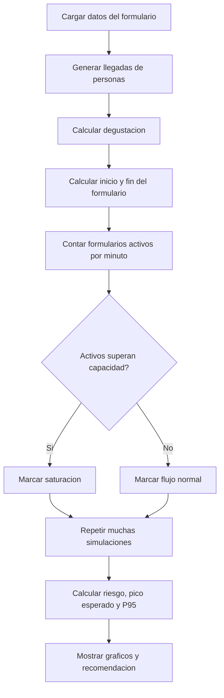
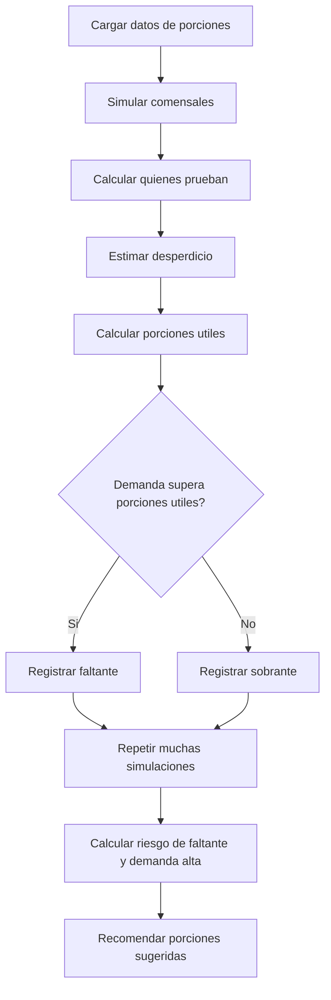
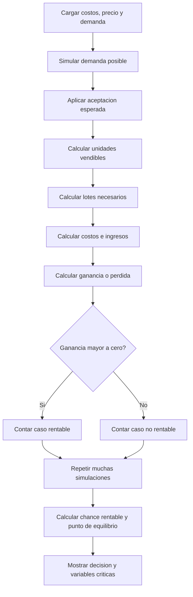

# Guia de estudio del simulador VitaCookies

Este documento explica el flujo del software en frases cortas.
La idea es entender que calcula cada simulador y como leer sus datos.

## Flujo general

1. Elegir una pestana: Formulario, Porciones o Viabilidad.
2. Cargar supuestos iniciales.
3. Elegir un escenario: Optimista, Esperado o Pesimista.
4. Indicar el Numero de simulaciones.
5. Ejecutar el simulador.
6. Leer metricas, graficos y recomendacion.
7. Descargar el informe si hace falta.

## Conceptos comunes

**Numero de simulaciones**

Es cuantas veces se repite el experimento virtual.
Si se usan 5.000 simulaciones, el sistema prueba 5.000 casos posibles.
Sirve para estimar riesgos, promedios y valores prudentes.

**Escenario Optimista**

Supone condiciones favorables.
Menos riesgo, mejores tiempos, menor desperdicio o mayor aceptacion.

**Escenario Esperado**

Usa los valores centrales cargados por el usuario.
Es el caso base.

**Escenario Pesimista**

Supone condiciones mas exigentes.
Mayor demanda, mas desperdicio, menor capacidad o menor aceptacion.

**P95**

Es un valor prudente.
Significa que el 95% de las simulaciones queda por debajo de ese numero.
Se usa para decidir con margen de seguridad.

**Riesgo (%)**

Es el porcentaje de simulaciones donde aparece un problema.
Por ejemplo: saturacion del formulario o faltante de porciones.

## Simulador 1: Formulario

### Para que sirve

Evalua si el formulario digital puede saturarse.
La pregunta central es: "pueden responder muchas personas al mismo tiempo sin trabar el sistema?"

### Datos que se cargan

- Personas que llegan por hora.
- Duracion del testeo.
- Minutos de degustacion.
- Minutos para responder el formulario.
- Formularios simultaneos que aguanta.
- Numero de simulaciones.
- Escenario.

### Que ejecuta

1. Genera llegadas de personas durante el evento.
2. Calcula cuando cada persona termina de degustar.
3. Calcula cuando empieza y termina el formulario.
4. Cuenta cuantos formularios estan activos por minuto.
5. Compara esa cantidad contra la capacidad.
6. Repite el proceso muchas veces.

### Datos principales

**Riesgo de saturacion**

Porcentaje de simulaciones donde se supera la capacidad.
Si es alto, conviene organizar respuestas por tandas.

**Pico esperado**

Cantidad promedio de formularios activos al mismo tiempo.
Es una lectura normal del evento.

**Pico prudente**

Cantidad alta de formularios activos usando P95.
Sirve para preparar el sistema con margen.

**Minutos saturados promedio**

Tiempo promedio en que el sistema queda por encima de la capacidad.
Mientras mas alto, mas probable es que haya problemas reales.

### Como leer los graficos

**Ejemplo minuto a minuto**

Muestra una simulacion concreta.
La linea verde son formularios activos.
La linea naranja es la capacidad.
Si la verde supera la naranja, hay saturacion.

**Riesgo por escenario**

Compara el riesgo en optimista, esperado y pesimista.
Tiene una sola unidad: porcentaje.

**Pico prudente por escenario**

Compara cuantos formularios simultaneos se deberian soportar.
Tiene una sola unidad: formularios.

**Que dato mueve mas el riesgo**

Prueba que pasa si cambia la llegada, el tiempo de formulario o la capacidad.
Ayuda a detectar la variable mas sensible.

### Diagrama secuencial

## Simulador 2: Porciones

### Para que sirve

Evalua si las porciones preparadas alcanzan para el testeo.
La pregunta central es: "cuantas porciones conviene preparar para no quedarse corto?"

### Datos que se cargan

- Porciones iniciales.
- Comensales esperados.
- Personas que probarian (%).
- Desperdicio estimado (%).
- Reserva extra (%).
- Numero de simulaciones.
- Escenario.

### Que ejecuta

1. Simula cuantos comensales asisten.
2. Calcula cuantos deciden probar el producto.
3. Estima desperdicio o perdida de porciones.
4. Calcula porciones utiles.
5. Compara demanda contra porciones utiles.
6. Repite el proceso muchas veces.

### Datos principales

**Riesgo de faltante**

Porcentaje de simulaciones donde no alcanzan las porciones.
Si es alto, conviene producir mas o preparar reserva.

**Demanda alta**

Cantidad de porciones pedidas en un caso exigente.
Usa P95.

**Faltante promedio**

Promedio de porciones que faltan cuando la demanda supera el stock util.

**Sobrante promedio**

Promedio de porciones que sobran.
Sirve para controlar desperdicio.

**Porciones sugeridas**

Cantidad recomendada para cubrir la demanda con margen.
Incluye la reserva extra cargada por el usuario.

### Como leer los graficos

**Cuantas porciones podrian pedir**

Muestra la distribucion de demanda.
Ayuda a ver si la demanda se concentra o varia mucho.

**Cuantas porciones podrian sobrar**

Muestra sobrantes posibles.
Ayuda a balancear faltantes contra desperdicio.

**Riesgo de faltante por escenario**

Compara el riesgo en cada escenario.
Tiene una sola unidad: porcentaje.

**Porciones sugeridas por escenario**

Compara la produccion recomendada.
Tiene una sola unidad: porciones.

**Que dato mueve mas el riesgo**

Prueba cambios en comensales, probabilidad de prueba y desperdicio.
Sirve para saber que supuesto cuidar mas.

### Diagrama secuencial

## Simulador 3: Viabilidad

### Para que sirve

Evalua si VitaCookies puede ser rentable con ciertos costos, precio y demanda.
La pregunta central es: "con estos supuestos, vale la pena escalar?"

### Datos que se cargan

- Costo por lote.
- Unidades por lote.
- Costos fijos.
- Desperdicio productivo (%).
- Precio de venta.
- Demanda esperada.
- Aceptacion esperada (%).
- Numero de simulaciones.
- Escenario.

### Que ejecuta

1. Simula demanda posible.
2. Ajusta la demanda segun aceptacion sensorial.
3. Calcula unidades utiles por lote.
4. Calcula cuantos lotes hacen falta.
5. Calcula costos totales.
6. Calcula ingresos.
7. Calcula ganancia o perdida.
8. Repite el proceso muchas veces.

### Datos principales

**Chance rentable**

Porcentaje de simulaciones con ganancia positiva.
Si es bajo, el producto necesita ajustes.

**Ganancia promedio**

Promedio de ganancia entre todas las simulaciones.
Puede ser negativo si los costos superan ingresos.

**Ganancia baja**

Caso desfavorable.
Sirve para medir riesgo economico.

**Costo unitario**

Costo aproximado por unidad util producida.
Sube si aumenta desperdicio o costo por lote.

**Punto de equilibrio**

Cantidad de unidades que se necesitan vender para cubrir costos fijos.
Si no se alcanza, el modelo indica "No alcanzable".

### Como leer los graficos

**Que ganancia podria aparecer**

Muestra muchas ganancias posibles.
La linea de cero separa perdida de ganancia.

**Ganancia segun unidades vendidas**

Relaciona demanda efectiva con ganancia.
Si vender mas no mejora suficiente, el problema suele estar en costos o precio.

**Chance rentable por escenario**

Compara la probabilidad de ganar dinero.
Tiene una sola unidad: porcentaje.

**Ganancia promedio por escenario**

Compara el resultado economico promedio.
Tiene una sola unidad: pesos.

**Variables criticas por impacto en ganancia**

Muestra que variable cambia mas la ganancia.
Sirve para priorizar ajustes.

**Ganancia si mejora un dato**

Compara el caso base contra mejoras posibles.
Por ejemplo: mas aceptacion o menos desperdicio.

### Diagrama secuencial

## Chequeos

La pestana Chequeos muestra controles internos.
Sirve para confirmar que los resultados no tengan valores imposibles.

Ejemplos:

- No hay tiempos negativos.
- No hay cantidades negativas.
- Las probabilidades quedan entre 0% y 100%.
- Los costos no son negativos.

## Como explicar el software en una frase

El simulador no predice exactamente el futuro.
Prueba muchos futuros posibles para estimar riesgos y tomar mejores decisiones.
