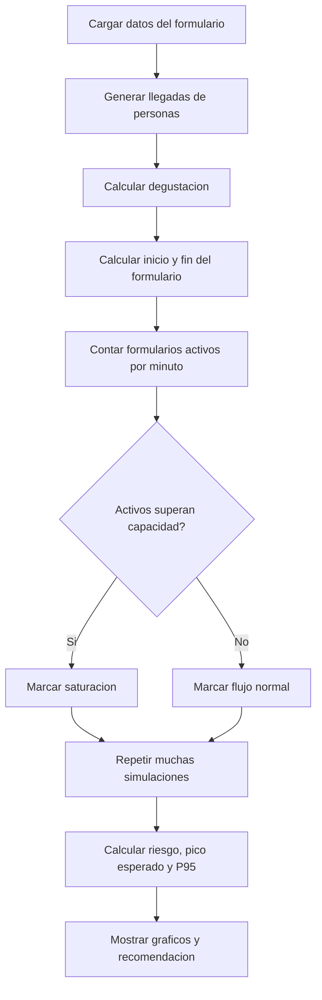
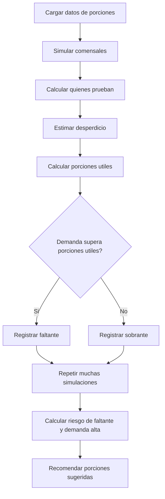
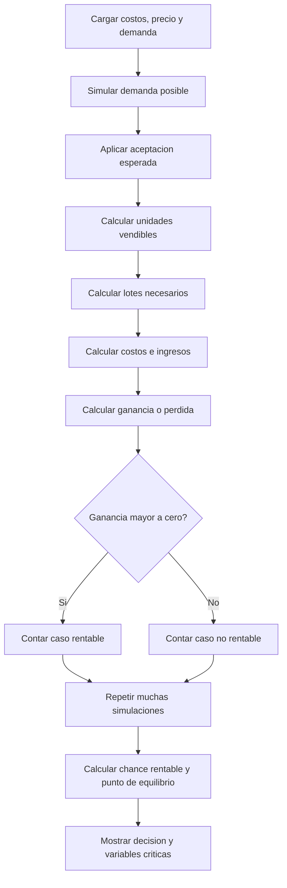

# Documentacion tecnica y academica

## Proposito del proyecto

VitaCookies Simulator es una herramienta de apoyo a la toma de decisiones.
No busca predecir el futuro con exactitud.
Busca probar muchos escenarios posibles antes del testeo sensorial.

La herramienta ayuda a responder tres preguntas:

1. Puede saturarse el formulario digital?
2. Alcanzan las porciones preparadas?
3. El producto podria ser viable economicamente?

## Relacion con Modelos y Simulacion

El trabajo aplica simulacion para estudiar un sistema real antes de intervenirlo.
El sistema real es el evento de testeo de VitaCookies.

Se usan dos enfoques:

- **Eventos discretos:** para el flujo de personas y formulario.
- **Monte Carlo:** para porciones y viabilidad.

La simulacion permite trabajar con incertidumbre.
En vez de usar un solo resultado fijo, se repite el experimento muchas veces.
Asi se estiman riesgos, promedios, percentiles y decisiones prudentes.

## Flujo general del software

1. El usuario carga supuestos.
2. Elige escenario: Optimista, Esperado o Pesimista.
3. Define el numero de simulaciones.
4. El modelo ejecuta muchos casos posibles.
5. El sistema resume metricas y graficos.
6. El software sugiere una decision.

## Simulador 1 - Formulario

### Sistema

Personas que llegan al testeo, degustan VitaCookies y completan un formulario digital.

### Objetivo

Evaluar si muchas respuestas al mismo tiempo pueden superar la capacidad del formulario.

### Entradas

- Personas que llegan por hora.
- Duracion del testeo.
- Tiempo de degustacion.
- Tiempo para responder.
- Formularios simultaneos soportados.
- Numero de simulaciones.
- Escenario.

### Proceso

1. Se simula la llegada de personas.
2. Se calcula cuando terminan de degustar.
3. Se calcula cuando responden el formulario.
4. Se cuenta cuantas respuestas ocurren al mismo tiempo.
5. Se compara contra la capacidad.
6. Se repite muchas veces.

### Salidas

- Riesgo de saturacion.
- Pico esperado.
- Pico prudente P95.
- Minutos saturados promedio.
- Recomendacion operativa.

### Decision que apoya

Si el riesgo es alto, conviene escalonar respuestas o tener respaldo.
Si el riesgo es bajo, se puede mantener el esquema previsto.

### Diagrama secuencial

## Simulador 2 - Porciones

### Sistema

Porciones disponibles para las personas que asisten al testeo.

### Objetivo

Evaluar si las porciones alcanzan y cuanta reserva conviene preparar.

### Entradas

- Porciones iniciales.
- Comensales esperados.
- Personas que probarian el producto.
- Desperdicio estimado.
- Reserva extra.
- Numero de simulaciones.
- Escenario.

### Proceso

1. Se simula cuantas personas asisten.
2. Se calcula cuantas prueban VitaCookies.
3. Se estima desperdicio.
4. Se calculan porciones utiles.
5. Se compara demanda contra porciones utiles.
6. Se repite muchas veces.

### Salidas

- Riesgo de faltante.
- Demanda alta P95.
- Faltante promedio.
- Sobrante promedio.
- Porciones sugeridas.

### Decision que apoya

Si el riesgo de faltante es alto, conviene producir mas.
Si el sobrante es alto, conviene ajustar produccion para no desperdiciar.

### Diagrama secuencial

## Simulador 3 - Viabilidad

### Sistema

Produccion y posible venta de VitaCookies.

### Objetivo

Evaluar si el producto puede ser rentable con ciertos costos, precio y demanda.

### Entradas

- Costo por lote.
- Unidades por lote.
- Costos fijos.
- Desperdicio productivo.
- Precio de venta.
- Demanda esperada.
- Aceptacion esperada.
- Numero de simulaciones.
- Escenario.

### Proceso

1. Se simula demanda posible.
2. Se ajusta por aceptacion sensorial.
3. Se calculan unidades vendibles.
4. Se calculan lotes necesarios.
5. Se calculan costos e ingresos.
6. Se calcula ganancia o perdida.
7. Se repite muchas veces.

### Salidas

- Chance de rentabilidad.
- Ganancia promedio.
- Ganancia baja.
- Costo unitario.
- Punto de equilibrio.

### Decision que apoya

Si la chance rentable es alta, se puede pensar en escalar.
Si es baja, conviene revisar precio, costos, desperdicio o aceptacion.

### Diagrama secuencial

## Escenarios

Los escenarios no son decorativos.
Cambian parametros del modelo.

**Optimista**

Supone condiciones favorables.
Menor desperdicio, mejor aceptacion o mayor capacidad.

**Esperado**

Representa el caso base.
Usa los valores cargados como supuestos centrales.

**Pesimista**

Supone condiciones mas exigentes.
Mayor demanda, mas desperdicio, menor capacidad o menor aceptacion.

## Analisis de sensibilidad

El analisis de sensibilidad pregunta:
"Que variable cambia mas el resultado?"

Ejemplos:

- En formulario: llegada, tiempo de respuesta o capacidad.
- En porciones: comensales, probabilidad de prueba o desperdicio.
- En viabilidad: precio, costos, aceptacion o desperdicio.

Esto ayuda a priorizar.
No todas las variables tienen el mismo impacto.

## Verificacion

La verificacion revisa que el modelo funcione correctamente desde adentro.

Controles:

- No hay tiempos negativos.
- No hay cantidades negativas.
- Las probabilidades estan entre 0% y 100%.
- Los costos no son negativos.
- El modelo cambia cuando cambian los parametros.

## Validacion

La validacion compara la simulacion con datos reales.
Se completa despues del testeo sensorial.

Datos utiles para validar:

- Asistencia real.
- Tiempo real para responder el formulario.
- Porciones consumidas.
- Porciones desperdiciadas.
- Aceptacion sensorial.
- Costos reales.

Si los datos reales difieren mucho, el modelo se recalibra.
Eso no invalida el trabajo.
Muestra que el modelo aprende del evento real.

## Relacion con Tecnologia, Ciencia y Responsabilidad Social

Este proyecto no usa tecnologia solo para calcular.
Usa tecnologia para tomar mejores decisiones con impacto social.

### Tecnologia como herramienta social

El software ayuda a organizar un testeo real.
Reduce improvisacion.
Permite anticipar problemas antes de que afecten a las personas.

Ejemplo:

- Si se anticipa saturacion, se evitan demoras.
- Si se calcula mejor la produccion, se evita desperdicio.
- Si se revisa la viabilidad, se evita escalar una idea sin evidencia.

### Ciencia aplicada

El proyecto toma un problema concreto y lo estudia con metodo.
Se formulan supuestos.
Se ejecutan modelos.
Se comparan escenarios.
Se interpretan resultados.

No se presenta una opinion aislada.
Se presenta evidencia simulada.

### Responsabilidad social

El producto VitaCookies tiene una dimension social porque se vincula con:

- alimentacion;
- sustentabilidad;
- aprovechamiento de recursos;
- accesibilidad economica;
- comunicacion clara con el equipo de Nutricion;
- reduccion de desperdicio.

La simulacion apoya decisiones responsables.
No se produce de mas sin analizar demanda.
No se promete rentabilidad sin revisar costos.
No se ignora la experiencia de las personas que prueban el producto.

### Sustentabilidad

El simulador de porciones se relaciona directamente con desperdicio.
Preparar demasiado puede generar residuos.
Preparar poco puede afectar la experiencia del testeo.

El objetivo responsable es equilibrar:

- disponibilidad;
- costo;
- desperdicio;
- calidad del evento.

### Etica de datos

El software trabaja con supuestos y datos agregados.
No necesita exponer datos personales.

Si luego se usan respuestas reales del formulario, deben tratarse con cuidado:

- no publicar nombres;
- no exponer datos sensibles;
- usar resultados agregados;
- informar para que se usan los datos.

### Tecnologia no neutral

Toda herramienta tecnica influye en decisiones.
Por eso los resultados no deben usarse de forma automatica.

El simulador recomienda.
Las personas deciden.

La decision final debe considerar:

- criterio tecnico;
- criterio nutricional;
- impacto social;
- costos;
- experiencia de usuarios;
- limites del modelo.

## Limites del modelo

Un modelo siempre simplifica la realidad.

Limitaciones principales:

- No modela preferencias individuales completas.
- La capacidad del formulario puede ser una estimacion.
- La aceptacion sensorial se resume en una variable.
- Los costos pueden cambiar si se escala la produccion.
- Los escenarios dependen de supuestos cargados por el usuario.

Estos limites deben mencionarse en la defensa.
Reconocer limites fortalece el trabajo.

## Preguntas posibles de defensa

### Por que usaron simulacion?

Porque permite anticipar riesgos sin esperar a que ocurran en el evento real.
Es util cuando hay incertidumbre en asistencia, demanda, tiempos y costos.

### El modelo predice exactamente lo que va a pasar?

No.
El modelo estima escenarios posibles.
Su valor esta en comparar riesgos y apoyar decisiones.

### Que significa Numero de simulaciones?

Es la cantidad de veces que se repite el experimento virtual.
Cuantas mas repeticiones, mas estable es la estimacion.

### Por que usan escenarios?

Porque no hay un unico futuro posible.
Los escenarios permiten comparar una situacion favorable, una base y una exigente.

### Que significa P95?

Es un valor prudente.
Indica que el 95% de los casos simulados queda por debajo.
Sirve para decidir con margen de seguridad.

### Como se relaciona con responsabilidad social?

Ayuda a evitar desperdicio, organizar mejor el evento y tomar decisiones con evidencia.
Tambien promueve un uso responsable de datos y tecnologia.

### La tecnologia reemplaza la decision humana?

No.
La tecnologia apoya la decision.
La decision final debe considerar criterios tecnicos, nutricionales y sociales.

### Que pasa si los datos reales no coinciden con la simulacion?

Se recalibra el modelo.
Eso es parte normal del metodo cientifico.
El modelo se mejora al comparar supuestos con datos reales.

### Donde esta la parte cientifica?

En formular supuestos, construir modelos, ejecutar simulaciones, analizar resultados y validar con datos reales.

### Donde esta la parte social?

En que el producto se relaciona con alimentacion, sustentabilidad, desperdicio, costos y experiencia de las personas.

### Que decision concreta aporta el software?

Ayuda a decidir:

- si hay que escalonar el formulario;
- cuantas porciones preparar;
- si el producto es viable o necesita ajustes.

## Frase de cierre para defensa

El simulador no reemplaza al equipo.
Le da evidencia para decidir mejor.

Integra ciencia, tecnologia y responsabilidad social porque convierte datos e incertidumbre en decisiones mas cuidadas, sustentables y justificadas.
